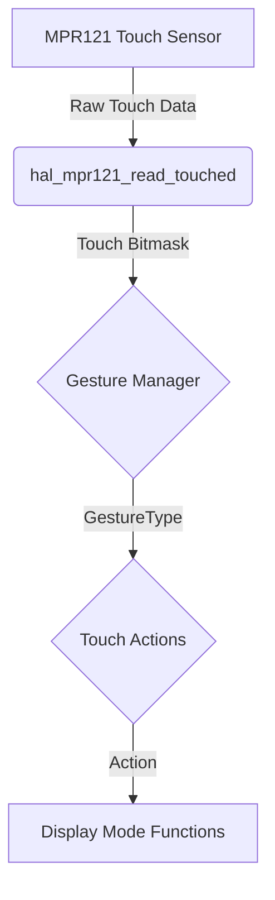

# Gesture Detection System

This document provides a comprehensive overview of the gesture detection system used in the Quil firmware. The system is designed to be non-blocking and extensible, allowing for the easy addition of new gestures and actions.

## System Architecture

The gesture detection system is composed of two main modules: `gesture_manager` and `touch_actions`.

*   **`gesture_manager`**: This module is responsible for decoding raw touch input from the MPR121 sensor into high-level gestures such as taps and swipes.
*   **`touch_actions`**: This module maps the detected gestures to specific actions based on the current display mode.

### Data Flow

The following diagram illustrates the data flow from raw touch input to action execution:



## Gesture Detection Logic

The `gesture_manager` uses a state machine and timing thresholds to detect gestures.

### Supported Gestures

*   **Single Tap**: A touch and release on a single electrode within 300ms.
*   **Double Tap**: Two single taps within a 600ms window.
*   **Swipe Left**: A touch moving from a higher-numbered electrode to a lower-numbered one (e.g., 11 to 8) within 400ms.
*   **Swipe Right**: A touch moving from a lower-numbered electrode to a higher-numbered one (e.g., 0 to 3) within 400ms.

### Timing Thresholds

-   **Single Tap**: < 300ms
-   **Double Tap**: < 600ms between taps
-   **Swipe**: < 400ms for the complete sequence
-   **Tap Timeout**: 600ms (resets the tap counter)

## Action Mapping

The `touch_actions` module maps gestures to actions based on the current display mode.

| Gesture | TIME_DATE | MUSIC | CHAT | THEME_PREVIEW | WIFI_INFO |
|---|---|---|---|---|---|
| **Single Tap** | - | Play/Pause | Mute/Unmute | Apply Theme | - |
| **Double Tap** | Cycle Mode | Cycle Mode | Cycle Mode | Cycle Mode | Cycle Mode |
| **Swipe Left** | - | Previous Track | - | Previous Theme | - |
| **Swipe Right**| - | Next Track | - | Next Theme | - |

## Integration

The gesture system is integrated into the main application loop in `main.cpp`.

```cpp
// In the main loop:
uint16_t touch = hal_mpr121_read_touched();
GestureType gest = gesture_detect(touch, millis());

if (gest != GESTURE_NONE) {
  actions_handle(gest, state_get_mode());
}
```

### Initialization

The gesture system is initialized in the `setup()` function:

```cpp
// In setup():
gesture_init();
actions_init();
```

## Performance

-   **Non-Blocking**: The entire system is non-blocking and uses `millis()` for timing.
-   **Polling Rate**: Gestures are checked every 10ms (the main loop delay).
-   **Memory Usage**: The system uses a small, static amount of memory and does not allocate from the heap.

## Future Enhancements

-   **Long Press**: Detect when an electrode is held down for an extended period.
-   **Multi-Touch**: Recognize gestures involving multiple simultaneous touches.
-   **Customizable Gestures**: Allow users to define their own gestures and actions.
