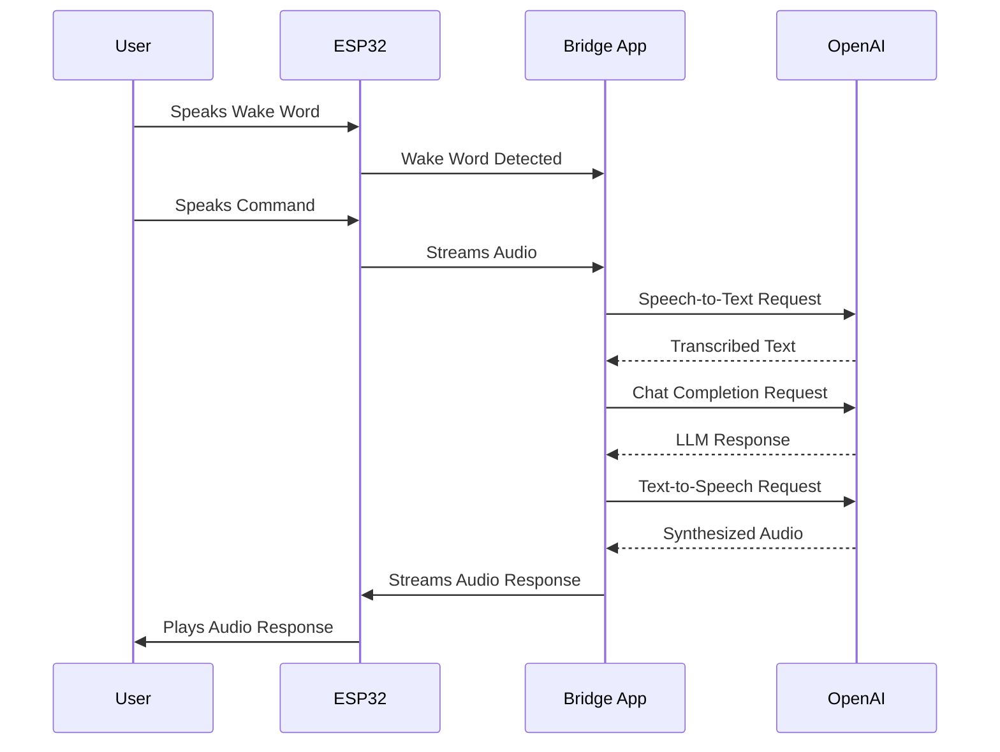

# Voice and LLM Integration Guide

This document describes the architecture and implementation of the voice and Large Language Model (LLM) integration in the Quil firmware. This system enables voice-based interaction with the device, allowing users to speak commands and receive audible responses.

## System Architecture

The voice integration is split between the ESP32 firmware and a separate "bridge" application that runs on a host computer.

*   **ESP32 Firmware**: Handles wake word detection, audio capture, and playback of responses.
*   **Bridge App**: Receives audio from the ESP32, processes it using cloud-based AI services (OpenAI), and sends the response back to the device.

### Voice Processing Pipeline

The following diagram illustrates the end-to-end voice processing pipeline:



## Firmware Modules

### `voice_manager`

Manages I2S audio capture and playback.

-   `voice_init()`: Initializes the microphone and speaker.
-   `voice_start_listening()`: Begins capturing audio from the microphone.
-   `voice_stop_listening()`: Stops the audio capture.
-   `voice_read_buffer()`: Reads a chunk of audio data from the microphone.
-   `voice_play_response()`: Plays back an audio response through the speaker.

### `wake_manager`

Detects the "Hey Quil" wake word.

-   `wake_init()`: Initializes the wake word detector.
-   `wake_detect()`: Checks for the wake word in the audio stream.
-   `wake_set_threshold()`: Adjusts the sensitivity of the detector.

### `llm_bridge`

Handles communication with the bridge application.

-   `bridge_init()`: Initializes the serial communication bridge.
-   `bridge_send_audio()`: Streams audio data to the bridge.
-   `bridge_handle_response()`: Receives and processes responses from the bridge.

## Bridge Application

The bridge application is a crucial component of the voice integration system. It acts as an intermediary between the ESP32 and the cloud-based AI services.

### Responsibilities

1.  **Receives Audio**: Listens for incoming audio data from the ESP32 over a serial connection.
2.  **Speech-to-Text**: Sends the audio data to OpenAI's Whisper API to be transcribed into text.
3.  **LLM Interaction**: Forwards the transcribed text to a large language model (e.g., GPT-4o-mini) to generate a response.
4.  **Text-to-Speech**: Uses OpenAI's TTS API to convert the LLM's text response into audio.
5.  **Sends Response**: Streams the synthesized audio back to the ESP32 for playback.

This architecture keeps the resource-intensive AI processing off of the microcontroller, allowing the ESP32 to focus on real-time tasks.

## Communication Protocol

### ESP32 to Bridge

*   **Wake Word**: A JSON message is sent to signal that the wake word has been detected.
    ```json
    {"event": "wake_quil"}
    ```
*   **Audio Stream**: Raw audio data is sent as a binary stream.

### Bridge to ESP32

*   **Audio Response**: The synthesized audio response is sent as a binary stream of PCM or WAV data.


